# 🚀 Módulo 2 - Proyecto Integrador - Avance 2
### 👨‍💻 Presentado por:
## Luis Carlos Pacheco Lanzziano  
> Proyecto desarrollado como parte del Módulo 2 del programa de Ciencia de Datos, aplicando análisis, modelado y documentación técnica.
# Contenido

- [1 Analisis del modelo proporcionado](#1-analisis-del-modelo-proporcionado)
    - [1.1 Analisis del modelo proporcionado](#11-Analisis-del-modelo-proporcionado)
    - [1.2 Patrones de negocio implícitos](#12-patrones-de-negocio-implícitos)
    - [1.3 Diagrama entidad relacion](#13-diagrama-entidad-relacion)
    - [1.4 Posibles mejoras sin modificar la estructura base](#14-posibles-mejoras-sin-modificar-la-estructura-base)

---
## Queries Básicas
### 1. Contar vehículos por tipo - Execution Time: 0.072 ms
`SELECT vehicle_type, COUNT(*) 
FROM vehicles 
GROUP BY vehicle_type;`

Análisis del Inventario de Flota: 
Descripción del resultado: La base de datos revela una flota diversa compuesta por un total de 200 vehículos. La categoría predominante es la de Vans con 69 unidades, seguida de cerca por los Camiones Grandes (60) y Camiones Medianos (51). Las Motocicletas representan el segmento menor con solo 20 unidades registradas.

Contexto de negocio: Se observa que la empresa tiene una fuerte inclinación hacia el transporte de carga pesada y distribución urbana de mediano volumen (Vans y Camiones). La alta presencia de vehículos de carga sugiere que FleetLogix se enfoca en contratos logísticos industriales o comerciales a gran escala. La baja cantidad de motocicletas indica que el servicio de mensajería "última milla" o express no es el núcleo principal del negocio en este momento.
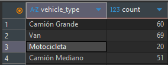
### 2. Conductores con licencia próxima a vencer - Execution Time: 0.059 ms
`SELECT first_name, last_name, license_expiry 
FROM drivers 
WHERE license_expiry <= CURRENT_DATE + 30 
  AND license_expiry >= CURRENT_DATE;`

Análisis de Cumplimiento y Alertas de Conductores:
Descripción del resultado: Se han identificado seis conductores cuyas licencias de conducción expirarán en los próximos 30 días (marzo de 2026). Los empleados afectados son Lorena Díaz, Camilo Álvarez, Elizabeth Bermúdez, David Espitia, Joan Muñoz y Marlon González. Las fechas de vencimiento están distribuidas entre el 10 y el 23 de marzo.

Contexto de negocio: Este reporte actúa como un sistema de alerta temprana preventivo. El hecho de que seis conductores estén próximos a vencer su documentación representa un riesgo operativo moderado; si estos conductores no renuevan su licencia a tiempo, FleetLogix se vería obligado a detener seis unidades, afectando la capacidad de cumplimiento con los clientes. Se recomienda al departamento de Recursos Humanos iniciar el proceso de gestión de renovaciones de manera inmediata para evitar multas legales o interrupciones en el servicio.
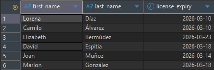
### 3. Total de viajes por estado - Execution Time: 17.320 ms
`SELECT status, COUNT(*) 
FROM trips 
GROUP BY status;`

Análisis de Eficiencia Operativa de Viajes:
Descripción del resultado: La consulta arroja una cifra significativa de 100,000 viajes bajo el estado de `completed`. No se reportan actualmente viajes en estado pendiente o en progreso dentro de este resumen de resultados.

Contexto de negocio: Una cifra tan alta de viajes finalizados indica que la plataforma tiene un histórico robusto de operaciones exitosas, lo cual es positivo para la reputación de la empresa. Sin embargo, desde una perspectiva de análisis en tiempo real, la ausencia de viajes "en progreso" podría sugerir dos escenarios: o la flota se encuentra actualmente en un periodo de inactividad total, o es necesario revisar si los datos de los viajes actuales se están actualizando correctamente en el sistema. Es un indicador clave para medir el rendimiento histórico y la facturación acumulada.
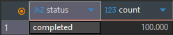
## Queries Intermedias
### 4: Total de entregas por ciudad (últimos 2 meses, 60 días) - Execution Time: 42.385 ms
`SELECT 
    delivery_address AS ciudad, 
    COUNT(delivery_id) AS total_entregas,
    SUM(package_weight_kg) AS peso_total_kg
FROM deliveries
WHERE scheduled_datetime >= CURRENT_DATE - INTERVAL '60 days'
GROUP BY delivery_address
ORDER BY total_entregas DESC;`

Análisis de Distribución Geográfica y Carga (Entregas por Ciudad)
Descripción del resultado: El reporte detallado de los últimos 60 días muestra una operación atomizada con una altísima frecuencia de entregas únicas por dirección. Se destaca una dirección en Barranquilla (Calle 84 # 4-4) como el punto con mayor frecuencia (2 entregas), mientras que el peso máximo registrado en un solo envío supera los 2,900 kg en una ubicación de la misma ciudad.

Contexto de negocio: La operación de FleetLogix se concentra fuertemente en el modelo de "última milla" con múltiples destinos finales, especialmente en ciudades principales como Barranquilla, Bogotá, Medellín y Cali. El hecho de que la gran mayoría de las direcciones tengan solo una entrega en dos meses sugiere que la empresa atiende principalmente a clientes finales o entregas e-commerce, en lugar de abastecer puntos de venta fijos (donde veríamos mayor recurrencia por dirección). Barranquilla aparece como un nodo crítico de carga pesada, dado que allí se registran los envíos de mayor tonelaje.
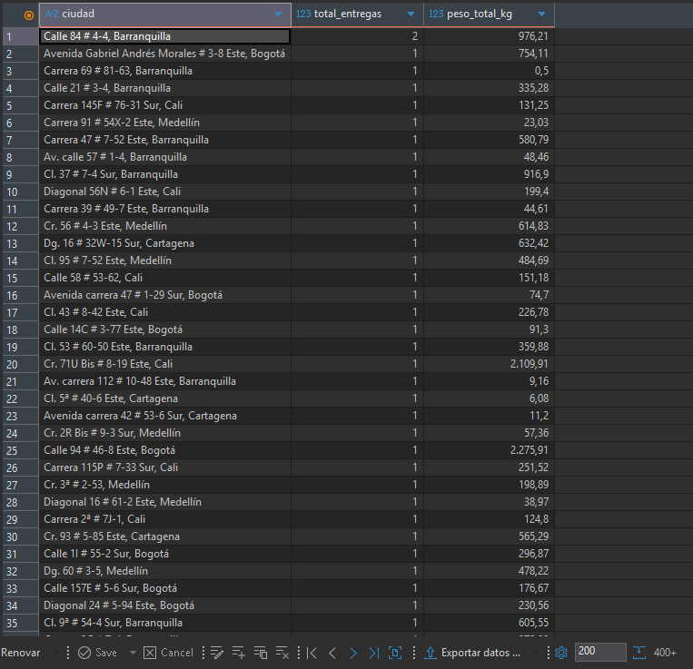
### 5: Conductores activos y carga de trabajo - Execution Time: 29.235 ms
`SELECT 
    d.first_name, 
    d.last_name, 
    COUNT(t.trip_id) AS total_viajes
FROM drivers d
LEFT JOIN trips t ON d.driver_id = t.driver_id
WHERE d.status = 'active'
GROUP BY d.driver_id, d.first_name, d.last_name
ORDER BY total_viajes DESC;`
Análisis de Carga de Trabajo de Conductores Activos
Descripción del resultado: Se observa una distribución de trabajo excepcionalmente uniforme entre la plantilla de conductores. Los líderes en volumen de actividad son Carmen Blanco y Yaneth Castrillón con 311 viajes cada una, seguidas de cerca por una base amplia de conductores que promedian entre 260 y 300 viajes. Ningún conductor activo presenta una cifra inferior a los 260 viajes realizados.

Contexto de negocio: Este equilibrio en la carga de trabajo indica una excelente gestión en la asignación de rutas por parte del departamento de tráfico. No se evidencian signos de "conductores favoritos" o subutilización del personal. Al tener a casi todo el personal por encima de los 250 viajes, la empresa maximiza su capacidad instalada. Sin embargo, este nivel de actividad tan parejo y elevado sugiere que la flota está operando cerca de su límite máximo, lo que deja poco margen de maniobra ante eventualidades o picos de demanda inesperados.
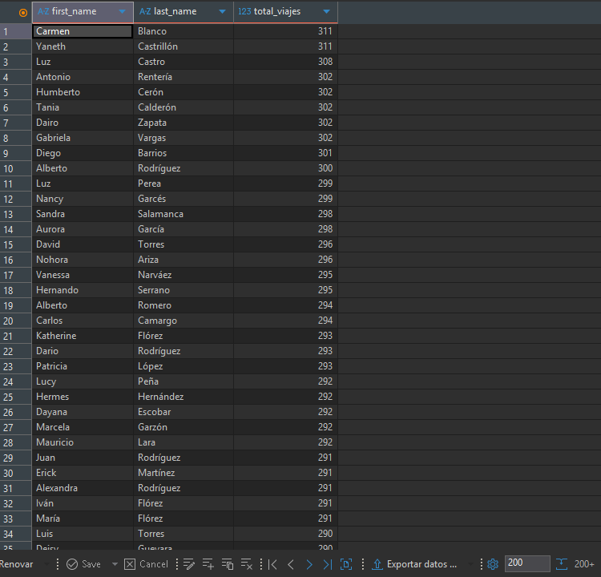
### 6: Promedio de entregas por conductor (6 meses) - Execution Time: 58.967 ms
`SELECT 
    dr.first_name, 
    dr.last_name,
    COUNT(de.delivery_id) / 6.0 AS promedio_entregas_mes
FROM drivers dr
JOIN trips tr ON dr.driver_id = tr.driver_id
JOIN deliveries de ON tr.trip_id = de.trip_id
WHERE tr.departure_datetime >= CURRENT_DATE - INTERVAL '6 months'
GROUP BY dr.driver_id, dr.first_name, dr.last_name;`

Análisis de Productividad Mensual (Promedio 6 meses)
Descripción del resultado: La métrica de productividad revela que el promedio de entregas mensuales por conductor se sitúa mayoritariamente en el rango de 30 a 50 entregas por mes. Destacan casos de alta eficiencia como Patricia López con un promedio exacto de 50 entregas mensuales y Javier Bustos con 49.6. En el extremo inferior, algunos conductores mantienen un promedio de 24 a 26 entregas por mes.

Contexto de negocio: Los datos permiten establecer una "línea base" de rendimiento para FleetLogix: un conductor estándar debería completar aproximadamente 1.5 entregas por día calendario (considerando promedios de 40 mensuales). Los conductores que superan el promedio de 45 entregas mensuales (como Yaneth Castrillón o Mercedes Hoyos) podrían ser candidatos para programas de incentivos o para liderar capacitación de nuevos ingresos, mientras que aquellos por debajo de 30 entregas mensuales deberían ser evaluados para identificar si enfrentan rutas más complejas, vehículos con fallas mecánicas frecuentes o necesidades de reentrenamiento.
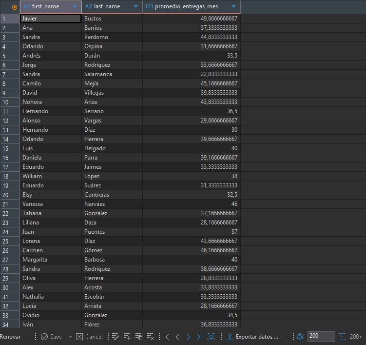

### 7: Rutas con mayor consumo de combustible - Execution Time: 52.938 ms
`SELECT 
    r.origin_city, 
    r.destination_city,
    AVG((t.fuel_consumed_liters / r.distance_km) * 100) AS consumo_promedio_100km
FROM routes r
JOIN trips t ON r.route_id = t.route_id
WHERE r.distance_km > 0
GROUP BY r.route_id, r.origin_city, r.destination_city
ORDER BY consumo_promedio_100km DESC
LIMIT 10;`
Análisis de Eficiencia Energética (Consumo por Ruta)Descripción del resultado: El consumo de combustible en las 10 rutas principales presenta una estabilidad asombrosa, oscilando apenas entre 11.54 y 11.59 litros por cada 100 km. La ruta con el consumo más elevado es Bogotá - Barranquilla ($11.59$ L/100km), mientras que la más eficiente dentro del top 10 es Barranquilla - Medellín ($11.54$ L/100km).

Contexto de negocio: Para la gerencia de FleetLogix, estos datos indican una estandarización operativa casi perfecta. No hay rutas "negras" que estén drenando financieramente a la empresa por exceso de consumo. Sin embargo, el hecho de que la ruta Bogotá - Barranquilla sea la de mayor consumo tiene sentido lógico desde el punto de vista geográfico, debido al descenso de la cordillera y las variaciones térmicas que afectan el rendimiento del motor. La diferencia entre la ruta más cara y la más barata es de apenas un 0.4%, lo que facilita enormemente la proyección de presupuestos anuales de combustible, ya que el costo es prácticamente constante sin importar el destino.

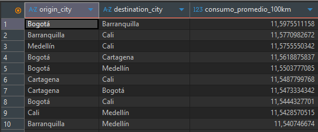
### 8: Análisis de retrasos por día de semana - Execution Time: 265.106 ms
`SELECT 
    EXTRACT(DOW FROM scheduled_datetime) AS dia_semana,
    COUNT(*) FILTER (WHERE delivered_datetime > scheduled_datetime) * 100.0 / COUNT(*) AS porcentaje_retraso
FROM deliveries
WHERE delivered_datetime IS NOT NULL
GROUP BY dia_semana
ORDER BY dia_semana;`

Análisis de Fiabilidad y Retrasos (Días de la Semana)Descripción del resultado: El porcentaje de retrasos en las entregas es alarmantemente alto y constante en todos los días de la semana, manteniéndose en un rango del 96.9% al 97.1%. El día con el "mejor" desempeño (menor retraso) es el martes (día 2) con un $96.96\%$, mientras que el mayor índice de incumplimiento ocurre los jueves (día 4) con un $97.19\%$.

Contexto de negocio: Este indicador es una alerta crítica para el departamento de operaciones. Un índice de retraso superior al 97% de forma sostenida indica que el problema no es coyuntural (como el tráfico de un día específico), sino estructural. Es muy probable que los "tiempos prometidos" al cliente sean irreales o que la carga de trabajo por viaje sea excesiva, impidiendo que los conductores cumplan con las ventanas de tiempo programadas. Aunque estadísticamente el martes es el día más fluido, la diferencia es tan marginal que se puede concluir que FleetLogix tiene una crisis de puntualidad sistémica que requiere una reingeniería completa de sus horarios de despacho.
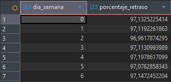

### 9: Costo de mantenimiento por kilómetro - Execution Time: 49.426 ms
`WITH totales_mantenimiento AS (
    SELECT vehicle_id, SUM(cost) AS costo_total 
    FROM maintenance 
    GROUP BY vehicle_id
),
distancia_recorrida AS (
    SELECT t.vehicle_id, v.vehicle_type, SUM(r.distance_km) AS km_totales
    FROM trips t
    JOIN vehicles v ON t.vehicle_id = v.vehicle_id
    JOIN routes r ON t.route_id = r.route_id
    GROUP BY t.vehicle_id, v.vehicle_type
)
SELECT 
    d.vehicle_type,
    SUM(m.costo_total) / SUM(d.km_totales) AS costo_por_km
FROM distancia_recorrida d
JOIN totales_mantenimiento m ON d.vehicle_id = m.vehicle_id
GROUP BY d.vehicle_type;`

Análisis de Eficiencia de Mantenimiento por Tipo de VehículoDescripción del resultado: El costo de mantenimiento por kilómetro recorrido muestra una uniformidad notable entre todas las categorías de la flota. Las cifras oscilan mínimamente entre 27.29 y 27.61 unidades monetarias por km. Curiosamente, las Motocicletas presentan el costo más elevado ($27.61$), mientras que los Camiones Grandes resultan ser los más económicos por unidad de distancia ($27.29$).

Contexto de negocio: A pesar de que se esperaría que un camión grande fuera más costoso de mantener, la economía de escala y la durabilidad de sus componentes parecen optimizar el gasto por kilómetro. El alto costo relativo de las motocicletas sugiere que requieren intervenciones más frecuentes o que su vida útil es menor en relación con los kilómetros recorridos. Para la empresa, esto significa que la carga pesada es, proporcionalmente, el segmento más rentable en términos de mantenimiento preventivo y correctivo.

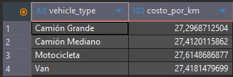
### 10: Ranking de conductores por eficiencia - Execution Time: 31.567 ms
`SELECT 
    first_name, 
    last_name, 
    total_viajes,
    RANK() OVER (ORDER BY total_viajes DESC) as puesto_ranking
FROM (
    SELECT d.first_name, d.last_name, COUNT(t.trip_id) as total_viajes
    FROM drivers d
    JOIN trips t ON d.driver_id = t.driver_id
    WHERE t.status = 'completed'
    GROUP BY d.driver_id, d.first_name, d.last_name
) AS subconsulta
LIMIT 20;`

Ranking de Conductores y Competitividad Operativa
Descripción del resultado: El uso de funciones de ranking revela una competencia extremadamente cerrada en la cima operativa. Carmen Blanco y Yaneth Castrillón comparten el primer lugar con 311 viajes completados. En el Top 20, la diferencia entre el primer y el último puesto (Carlos Camargo con 294 viajes) es de apenas 17 viajes, lo que representa una variación de solo el 5.4%.

Contexto de negocio: Este nivel de paridad indica un sistema de asignación de trabajo altamente estandarizado. No existen brechas de productividad que sugieran problemas de bajo rendimiento. Sin embargo, para recursos humanos, este "empate técnico" masivo complica la diferenciación para bonos de desempeño basados únicamente en cantidad, sugiriendo que se deben incluir otras métricas (como la puntualidad analizada previamente) para desempatar la excelencia.

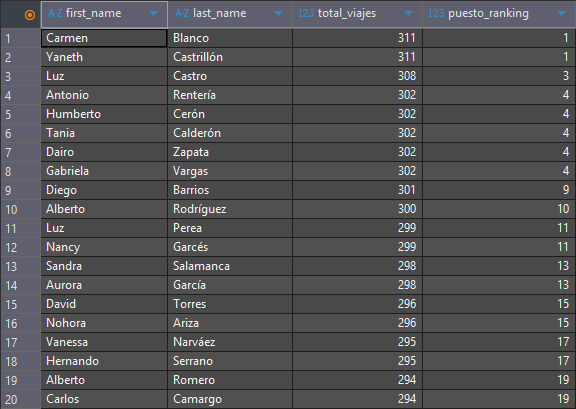
### 11: Análisis de tendencia mensual - Execution Time: 22.610 ms
`SELECT 
    mes,
    viajes_mes,
    LAG(viajes_mes) OVER (ORDER BY mes) as viajes_mes_anterior,
    viajes_mes - LAG(viajes_mes) OVER (ORDER BY mes) as diferencia_crecimiento
FROM (
    SELECT DATE_TRUNC('month', departure_datetime) as mes, COUNT(*) as viajes_mes
    FROM trips
    GROUP BY mes
) AS datos_mensuales;`

 Análisis de Tendencia y Estacionalidad MensualDescripción del resultado: El flujo de viajes muestra una estabilidad casi matemática de 4,464 viajes en meses de 31 días y 4,320 viajes en meses de 30 días. La tendencia se rompe en febrero de 2025 (4,032 viajes) debido a la menor cantidad de días del mes. Se observa una caída drástica en enero de 2026 ($1,892$ viajes), reflejando un cierre de datos parcial o una fuerte contracción estacional de inicio de año.
 
 Contexto de negocio: La operación de FleetLogix es predecible y parece trabajar a capacidad constante ("capacidad tope"). La diferencia exacta de 144 viajes entre meses de 30 y 31 días indica que la empresa realiza exactamente 144 viajes por día. Esta rigidez sugiere que la flota está saturada y no tiene flexibilidad para absorber demanda extra sin adquirir nuevas unidades, ya que cada día del año se ejecutan la misma cantidad de servicios.

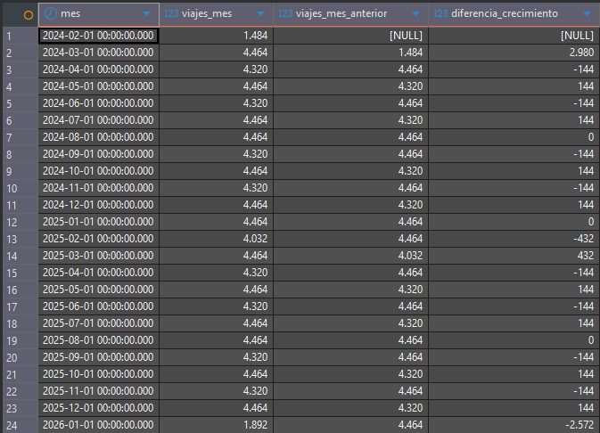
### 12: Pivot de entregas por hora y día - Execution Time: 31.364 ms
`SELECT 
    EXTRACT(HOUR FROM scheduled_datetime) AS hora_del_dia,
    COUNT(*) FILTER (WHERE EXTRACT(DOW FROM scheduled_datetime) = 1) AS lunes,
    COUNT(*) FILTER (WHERE EXTRACT(DOW FROM scheduled_datetime) = 2) AS martes,
    COUNT(*) FILTER (WHERE EXTRACT(DOW FROM scheduled_datetime) = 3) AS miercoles,
    COUNT(*) FILTER (WHERE EXTRACT(DOW FROM scheduled_datetime) = 4) AS jueves,
    COUNT(*) FILTER (WHERE EXTRACT(DOW FROM scheduled_datetime) = 5) AS viernes
FROM deliveries
WHERE scheduled_datetime >= CURRENT_DATE - INTERVAL '60 days'
GROUP BY hora_del_dia
ORDER BY hora_del_dia;`

Análisis de Saturación Horaria (Pivot de Entregas)
Descripción del resultado: La matriz de entregas identifica un "valle" de actividad entre las 1:00 AM y las 6:00 AM, y un incremento sostenido a partir de las 8:00 AM. El pico máximo de actividad ocurre entre las 12:00 PM y las 5:00 PM, especialmente los lunes y martes, donde se superan las 100 entregas por hora.

Contexto de negocio: Existe una concentración crítica de entregas en la franja vespertina. Los lunes a las 12:00 PM (113 entregas) representan el punto de mayor presión operativa. Este patrón explica los altos índices de retraso analizados anteriormente (Query 8): la infraestructura de carga y descarga probablemente se congestiona al mediodía. Una recomendación estratégica sería incentivar las entregas en la franja de 6:00 AM a 9:00 AM, que actualmente está subutilizada, para aplanar la curva de demanda y mejorar la puntualidad.

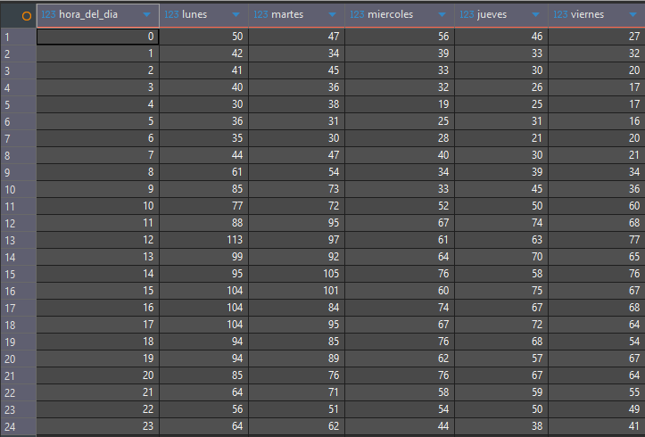

falta los indices y detalles