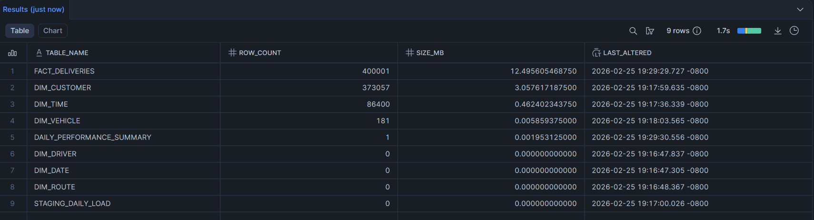
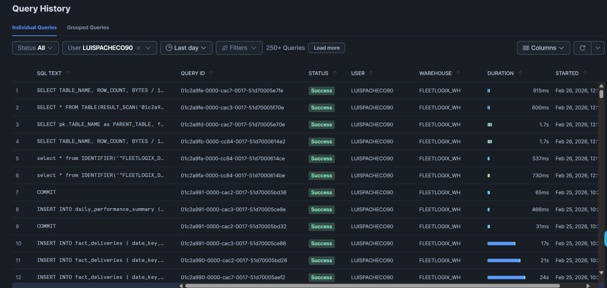
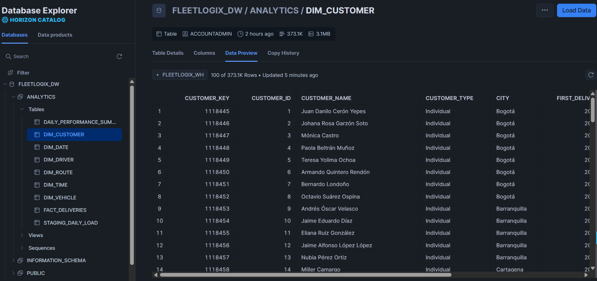

# 🚀 Módulo 2 - Proyecto Integrador - Avance 3
### 👨‍💻 Presentado por:
## Luis Carlos Pacheco Lanzziano  
## Historial de Optimización ETL FleetLogix
Este archivo documenta los cambios críticos realizados en el script A3-05_etl_pipeline_estudiantes.py para transformar un proceso ineficiente en una carga masiva de alto rendimiento.

- 1. Cambio de Paradigma: De Iterativo a Vectorizado

Cambio: Se eliminaron los bucles for index, row in df.iterrows() para cálculos de negocio.

Propósito: El uso de Pandas Vectorized Operations permite procesar 400,000 registros en la memoria RAM en milisegundos. Anteriormente, cada cálculo individual sumaba latencia innecesaria al tiempo total de ejecución.

- 2. Implementación de write_pandas (Bulk Loading)

Cambio: Sustitución de comandos INSERT individuales por la función write_pandas de Snowflake.

Propósito: Esta herramienta comprime los datos en formato Parquet y los sube a un Stage temporal. Esto reduce el tiempo de carga de las dimensiones de horas a segundos, eliminando miles de peticiones pequeñas a la red.

- 3. Uso de executemany con chunk_size

Cambio: Los registros de la tabla de hechos se agrupan en lotes de 15,000 registros (chunk_size = 15000).

Propósito: Evita el "cuello de botella" de la red. En lugar de realizar 400,000 viajes a la base de datos, el script realiza aproximadamente 27 viajes masivos. Esto equilibra la velocidad de carga sin agotar la memoria RAM del sistema local.

- 4. Deduplicación Agresiva en Memoria

Cambio: Aplicación de .drop_duplicates() en los datos de dimensiones antes de tocar Snowflake.

Propósito: Si un cliente o vehículo aparece miles de veces en los registros de entrega, el script ahora solo procesa el valor único una vez. Esto reduce drásticamente el número de operaciones MERGE necesarias.

- 5. Automatización de Infraestructura (Self-Healing)

Cambio: Creación de los métodos setup_infrastructure y setup_time_dimension.

Propósito:

Secuencias: Garantiza que los generadores de IDs (seq_customer_key, etc.) existan antes de la carga.

Dimensión de Tiempo: Genera automáticamente 86,400 registros (un día completo segundo a segundo) dentro de Snowflake usando un generador interno.

Tablas: Crea la tabla daily_performance_summary si no existe, asegurando que el cálculo de KPIs finales nunca falle.

- 6. Mapeo por Diccionarios (In-Memory Mapping)

Cambio: Las llaves foráneas (IDs de clientes, conductores y vehículos) se descargan a diccionarios de Python al inicio de la carga de hechos.

Propósito: Buscar una ID en un diccionario de Python es miles de veces más rápido que realizar una consulta SELECT a Snowflake por cada fila procesada.

## Descripción de las Querys implementadas
- 1. Generación de la Dimensión de Tiempo (dim_time)

Esta consulta utiliza un generador interno de Snowflake para crear datos sin necesidad de cargarlos desde un archivo externo:

generator(rowcount => 86400): Crea 86,400 filas instantáneamente, una por cada segundo del día.

timeadd(second, seq4(), '00:00:00'): Calcula cada segundo exacto partiendo desde la medianoche.

Lógica de Negocio: Clasifica automáticamente cada segundo en franjas como 'Mañana', 'Tarde' o 'Noche' y determina si es horario laboral (is_business_hour).

time_key: Se genera combinando HHMMSS para crear una llave natural que facilita los cruces (JOINs) rápidos.

- 2. Sincronización de Dimensiones (MERGE)

En lugar de insertar registros uno por uno, se utiliza la sentencia MERGE para gestionar cambios:

WHEN NOT MATCHED THEN INSERT: Compara la tabla de Staging (datos nuevos) con la dimensión final. Si el cliente o vehículo no existe, lo inserta.

Uso de Secuencias: Emplea seq_customer_key.NEXTVAL para asignar automáticamente un identificador único y correlativo a cada nuevo registro.

- 3. Carga Masiva de Hechos (INSERT por lotes)

Para la tabla de hechos, donde reside el volumen de 400,000 registros, la query está diseñada para la velocidad:

Inserción Directa: Se listan todas las columnas explícitamente para asegurar que los datos transformados en Python encajen perfectamente en la estructura de Snowflake.

etl_batch_id: Cada inserción marca los registros con un ID único de ejecución, lo que permite auditar la carga y borrar lotes específicos si hubo algún error en el proceso.

- 4. Resumen de Rendimiento (daily_performance_summary)

Esta consulta delega el cálculo matemático a Snowflake en lugar de hacerlo en la memoria de tu computadora:

Agregación SQL: Utiliza funciones como AVG, SUM y COUNT sobre el lote recién cargado (WHERE etl_batch_id = %s).

Eficiencia: Procesar estas sumas directamente en la base de datos sobre 400k filas toma menos de un segundo, mientras que en Python requeriría descargar y procesar todos los datos nuevamente.

- 5. Infraestructura de Soporte (CREATE IF NOT EXISTS)

CREATE SEQUENCE: Prepara los contadores automáticos para las llaves primarias de las dimensiones.

CREATE TABLE: Garantiza que la tabla de reporte final exista antes de intentar guardar los resultados, evitando errores de "Tabla no encontrada".

## Documentación de Seguridad y Autenticación
Para que el pipeline ETL funcione de manera segura, se ha implementado una autenticación basada en pares de llaves (Key-Pair Authentication), eliminando la necesidad de usar contraseñas en texto plano.

1. Instalación de Dependencias de Seguridad
Además de la integración con Pandas, se requiere una librería específica para manejar tokens de autenticación de forma segura en el almacenamiento local:

`pip install "snowflake-connector-python[secure-local-storage]"`
Propósito: Guarda los tokens de sesión de forma cifrada en el sistema operativo, evitando re-autenticaciones constantes y protegiendo las credenciales.

2. Generación del Par de Llaves (Criptografía)
El proceso utiliza el estándar RSA de 2048 bits para generar una identidad digital única para el usuario del ETL. Ejecuta estos comandos en tu terminal (Git Bash recomendado):

A. Generar Llave Privada y Pública (Formato PEM)

## Crea la llave privada
`openssl genrsa -out snowflake_key.pem 2048`

## Extrae la llave pública para subirla a Snowflake
openssl rsa -in snowflake_key.pem -pubout -out snowflake_key.pub
B. Conversión a Formato Binario (DER)
Snowflake Connector para Python requiere la llave en un formato específico llamado DER para procesarla correctamente en el código.

`openssl pkcs8 -topk8 -inform PEM -outform DER -in snowflake_key.pem -out snowflake_key.der -nocrypt`
C. Verificación de Archivos
Asegúrate de que el archivo .der se haya generado en la carpeta raíz de tu proyecto:

`ls -la snowflake_key.der`
3. Implementación en el Código
Una vez generados los archivos, el script FleetLogixETL utiliza el archivo snowflake_key.der para firmar digitalmente cada conexión:

Uso en Conexión: Se pasa como parámetro private_key al método snowflake.connector.connect.
- lista de tablas creadas

- Muestra del historial de querys

- Muestra del modelo creado
